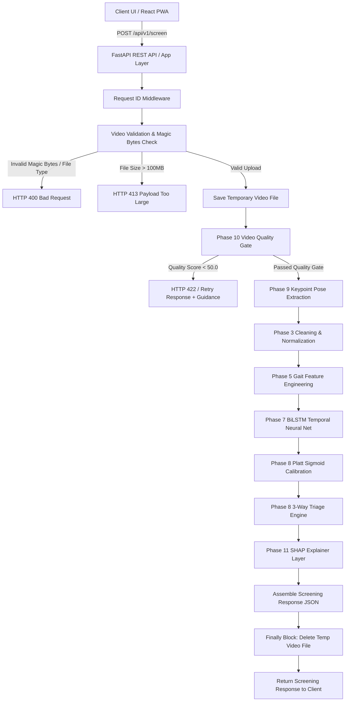
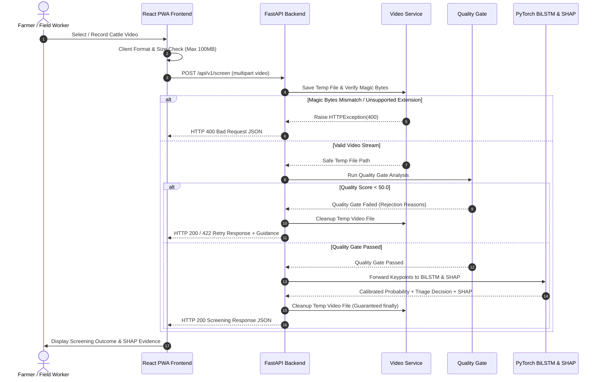

# GaitGuard AI — Technical Architecture & Component Specification

## 1. System Architecture Diagram

---

## 2. Component Layer Responsibilities

### 2.1 Client Layer (`frontend/src/`)
* **React PWA**: Single Page Application written in React 18 and TypeScript with Tailwind CSS.
* **State Machine**: Controls flow across states (`IDLE`, `CAPTURING`, `PREVIEW`, `SUBMITTING`, `RESULT`, `RETRY`, `ERROR`).
* **Client Validation**: Enforces extension checks (`.mp4`, `.avi`, `.mov`, `.mkv`, `.webm`) and 100MB max file size limits prior to HTTP transfer.
* **Memory Management**: Revokes local video preview object URLs (`URL.revokeObjectURL`) to prevent browser RAM leaks.

### 2.2 API Server Layer (`app/`)
* **FastAPI Application (`app/main.py`)**: Asynchronous web framework exposing `/health`, `/readiness`, `/version`, and `/api/v1/screen`.
* **Request Correlation Middleware**: Attaches `X-Request-ID: req_<uuid4_hex>` header to all incoming HTTP requests and log entries.
* **Video Upload Service (`app/services/video_service.py`)**: Verifies raw file magic byte signatures (`ftyp`, `RIFF`, `WebM`), sanitizes filenames, enforces path traversal containment within `TEMP_DIR`, streams chunks with 100MB cap, and guarantees temporary file deletion in a deterministic `finally` block.
* **Inference Orchestration Service (`app/services/inference_service.py`)**: Connects Quality Gate, keypoint extraction, BiLSTM model evaluation, Sigmoid calibration, 3-way triage, and SHAP explainability.

### 2.3 Machine Learning Pipeline (`gaitguard/`)
* **Phase 10 Quality Gate (`gaitguard/quality/`)**: Evaluates spatial framing, motion blur indicators, keypoint coverage, and frame rate.
* **Phase 9 Keypoint & Feature Pipeline (`gaitguard/inference/`)**: Formats 17 cattle keypoints across 128 frames into exact training-compatible 76-feature representation.
* **Phase 7 BiLSTM Model (`gaitguard/models/`)**: Bidirectional LSTM neural network evaluating temporal sequence dynamics over sequence windows.
* **Phase 8 Calibration & Triage (`gaitguard/triage/`)**: Platt Sigmoid scaling mapping raw predictions to calibrated probabilities; 3-way triage engine evaluating threshold $\tau = 0.34$ and inconclusive bounds $[0.24, 0.44]$.
* **Phase 11 SHAP Explainer (`gaitguard/explainability/`)**: Exact Deep SHAP attribution engine calculating Level 1 feature attributions and Level 2 domain gait metrics.

---

## 3. Screening Request Sequence Diagram

---

## 4. Execution Scope: Client vs Server

| Execution Task | Execution Location | Technology |
| :--- | :--- | :--- |
| **UI Rendering & State Machine** | Client Browser | React 18 + TypeScript + Tailwind |
| **Video Recording & Preview** | Client Browser | HTML5 MediaRecorder & `<video>` |
| **Client Format & Size Validation**| Client Browser | JavaScript `File` API |
| **Magic Byte Header Inspection** | Backend Server | Python `VideoService` Binary Reader |
| **Path Traversal Protection** | Backend Server | Python `os.path.realpath` Containment |
| **Video Decoding & Quality Gate** | Backend Server | OpenCV (`cv2`) & NumPy |
| **Keypoint Normalization & Features**| Backend Server | NumPy Vectorized Matrix Math |
| **BiLSTM Forward Pass Inference** | Backend Server | PyTorch (`torch.nn.Module`) CPU/GPU |
| **Sigmoid Calibration & Triage** | Backend Server | Scikit-Learn / Closed-Form Math |
| **SHAP Feature Attribution** | Backend Server | SHAP DeepExplainer |
| **Temporary Video Cleanup** | Backend Server | Python `os.remove` inside `finally` block |
