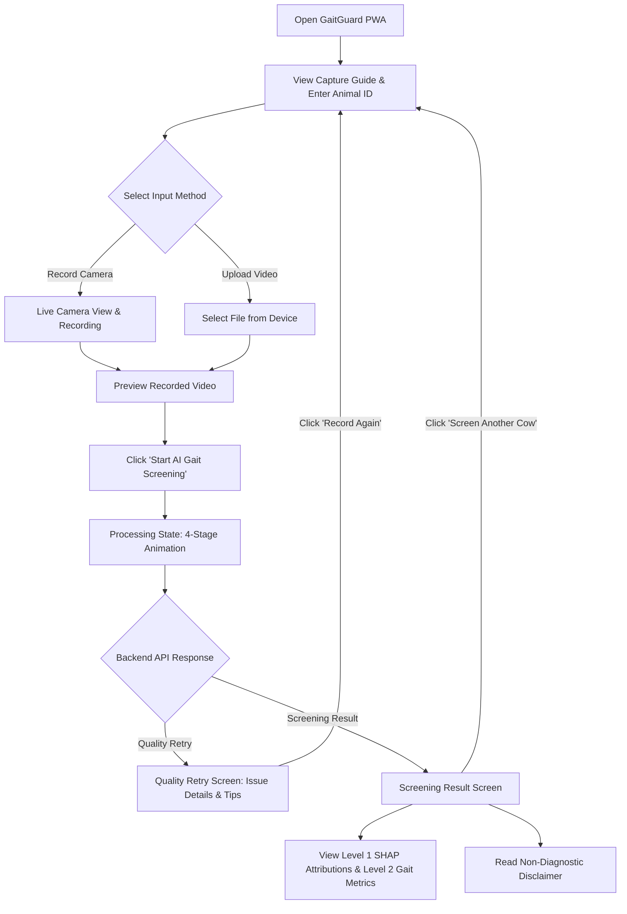

# GaitGuard AI — Phase 13 Farmer User Flow & State Machine

## 1. Primary User Journey

## 2. State Machine Transitions

| State | Trigger | Next State | Action / Visual |
| :--- | :--- | :--- | :--- |
| `IDLE` | App load | `IDLE` | Displays header, health indicator, capture guide, cow ID input, and primary action buttons. |
| `IDLE` | Click 'Record Video' | `CAPTURING` | Activates camera feed via `navigator.mediaDevices.getUserMedia`. |
| `IDLE` | File selected | `PREVIEW` | Loads selected video file into HTML5 preview player. |
| `CAPTURING` | Record & stop | `PREVIEW` | Creates recorded video Blob file and transitions to preview. |
| `PREVIEW` | Click 'Start AI Gait Screening' | `SUBMITTING` | Sends `POST /api/v1/screen` multipart payload to backend. |
| `SUBMITTING` | Backend returns `status: "retry"` | `RETRY` | Displays Phase 10 Quality Gate issues and capture tips. |
| `SUBMITTING` | Backend returns `status: "success"` | `RESULT` | Renders screening decision (`NORMAL`, `LAMENESS_RISK`, `INCONCLUSIVE`), calibrated risk %, and SHAP evidence. |
| `SUBMITTING` | Network / API failure | `ERROR` | Shows user-friendly error card with retry button. |
| `RETRY` / `RESULT` / `ERROR` | Click 'Reset / Screen Another' | `IDLE` | Clears video state and resets form for next animal. |
