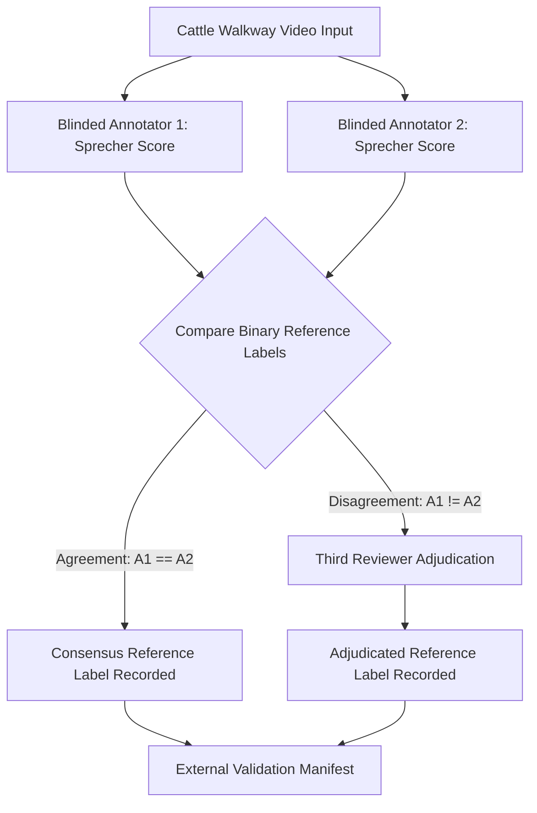

# GaitGuard AI — Phase 15 Blinded Double-Annotation & Adjudication Workflow

## 1. Workflow Architecture

## 2. Blinded Annotation Rules
1. **Model Output Isolation**: Annotators MUST NOT see GaitGuard predictions, probabilities, SHAP feature attributions, or Quality Gate scores.
2. **Peer Isolation**: Annotator 1 and Annotator 2 MUST NOT see each other's score entries prior to consensus submission.
3. **Adjudication Rule**: In cases of score disagreement between Annotator 1 and Annotator 2, a third senior veterinarian adjudicates the final reference score without overwriting original raw evaluator entries.
