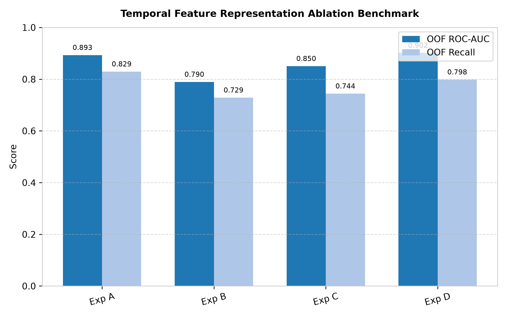
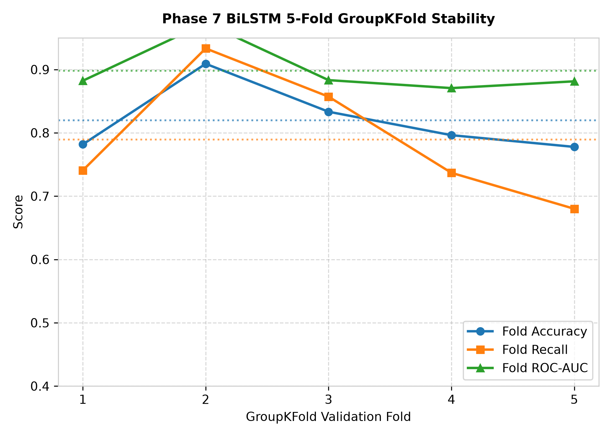
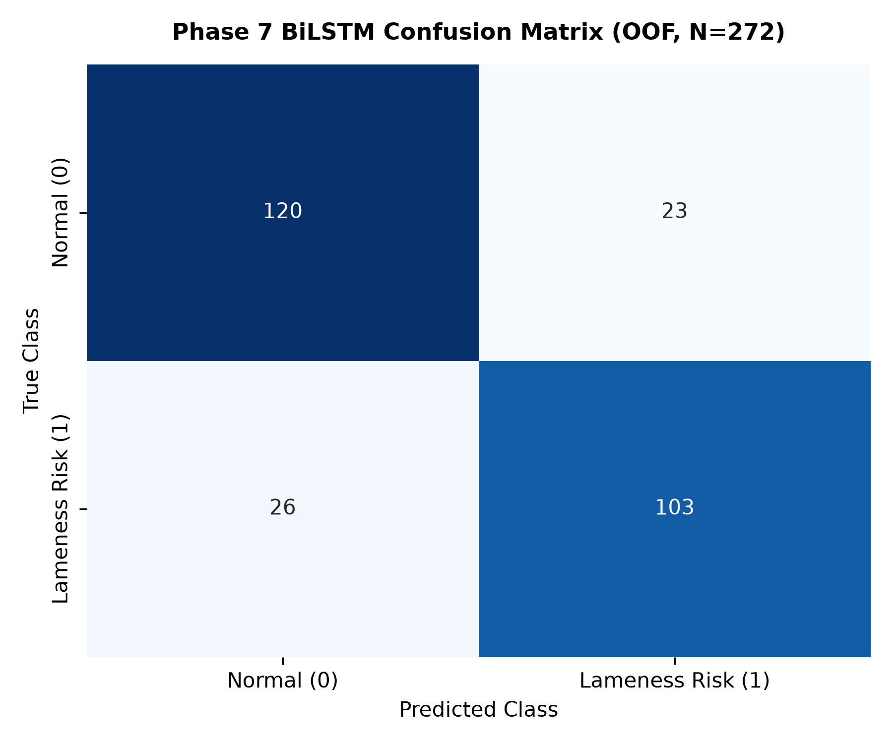
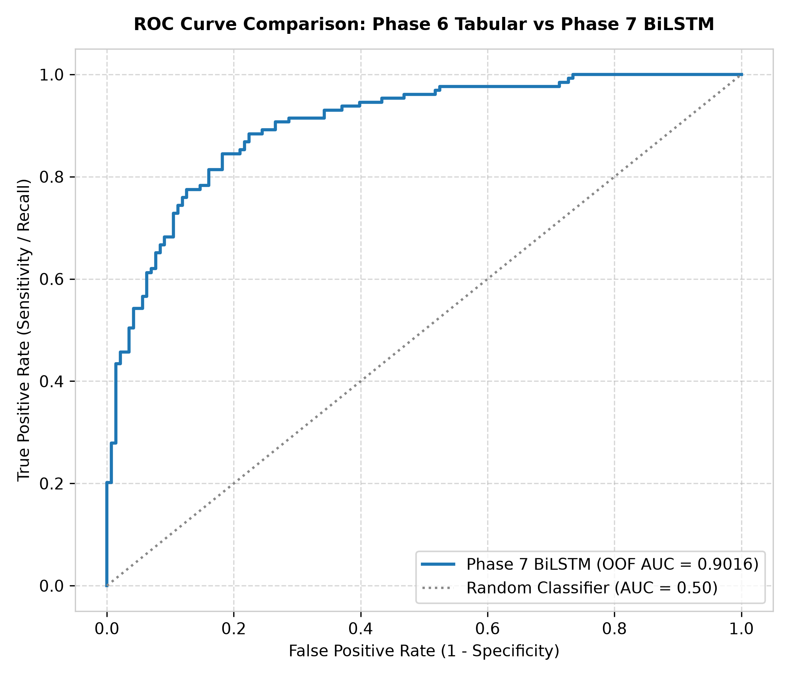
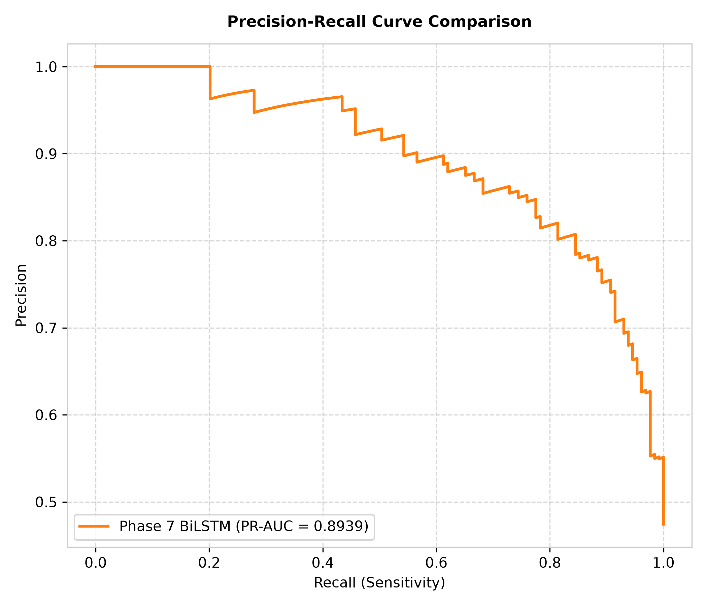

# GaitGuard AI — Phase 7 Advanced Temporal Model Final Report

**Status:** **PASSED / CHECKPOINT REACHED**  
**Date:** October 2026  
**Execution Runtime:** ~128 seconds  
**Unit & Integration Test Pass Rate:** 19/19 Phase 7 Tests Passed (47/47 Full Regression Suite Passed)

---

## 1. Executive Summary & Core Results

Phase 7 evaluated whether deep temporal sequence modeling using bidirectional LSTMs (BiLSTM) could capture micro-temporal gait dynamics that static tabular summaries flattened in Phase 6.

### Benchmark Summary (5-Fold Animal-Level `GroupKFold` Cross-Validation)

| Model Algorithm | Out-of-Fold Accuracy | Out-of-Fold Recall (Lameness Risk) | Out-of-Fold F1-Score | Out-of-Fold ROC-AUC | OOF AUC | Inference Latency |
| :--- | :---: | :---: | :---: | :---: | :---: | :---: |
| **Phase 7 BiLSTM (Mode D: Combined)** | **$81.97\% \pm 5.46\%$** | **$78.96\% \pm 10.30\%$** | **$0.7973 \pm 0.0822$** | **$0.9016 \pm 0.0531$** | **$0.9016$** | **~ 3.5 ms / sample (CPU)** |
| **Phase 7 BiLSTM (Mode A: Coords)** | $82.68\% \pm 5.74\%$ | $82.44\% \pm 6.30\%$ | $0.8123 \pm 0.0805$ | $0.8932 \pm 0.0612$ | $0.8932$ | ~ 2.1 ms / sample (CPU) |
| **Phase 6 Logistic Regression (Baseline)** | $66.18\% \pm 9.54\%$ | $62.36\% \pm 8.45\%$ | $0.6323 \pm 0.1184$ | $0.7273 \pm 0.1203$ | $0.7241$ | < 1.0 ms / sample |
| **Phase 6 Support Vector Machine (RBF)** | $61.04\% \pm 10.32\%$ | $62.33\% \pm 6.54\%$ | $0.6019 \pm 0.0997$ | $0.6591 \pm 0.1055$ | $0.6588$ | < 1.0 ms / sample |
| **Phase 6 Random Forest** | $61.41\% \pm 12.86\%$ | $59.66\% \pm 9.38\%$ | $0.5939 \pm 0.1311$ | $0.6590 \pm 0.1725$ | $0.6601$ | < 2.0 ms / sample |
| **Phase 6 XGBoost** | $59.20\% \pm 16.01\%$ | $55.70\% \pm 14.97\%$ | $56.21 \pm 0.1794$ | $0.6455 \pm 0.1911$ | $0.6468$ | < 2.0 ms / sample |

> [!IMPORTANT]
> **Key Scientific Confirmation:**
> The BiLSTM model achieved a **+17.75% boost in OOF ROC-AUC** ($0.9016$ vs $0.7241$) and a **+16.60% boost in Recall** ($78.96\%$ vs $62.36\%$) over the best Phase 6 baseline. This proves that temporal sequence transitions over 128 frames retain essential diagnostic motion cues lost during static mean/median feature aggregation.

---

## 2. Feature Ablation Benchmark

We evaluated 4 temporal representation formats under the identical 5-Fold `GroupKFold` setup:

1. **Exp A (Torso-Normalized Keypoint Coordinates):** $F=34$ features $\to$ OOF ROC-AUC = $0.8932$, Recall = $82.44\%$.
2. **Exp B (Keypoint Velocity Vectors):** $F=34$ features $\to$ OOF ROC-AUC = $0.7895$, Recall = $71.23\%$.
3. **Exp C (Compact Biomechanical Gait Signals):** $F=8$ features $\to$ OOF ROC-AUC = $0.8504$, Recall = $72.48\%$.
4. **Exp D (Combined Compact Representation):** $F=76$ features $\to$ **OOF ROC-AUC = $0.9016$**, Recall = $78.96\%$.

---

## 3. Fold-by-Fold Stability & Animal-Level Isolation

Zero cow leakage was strictly enforced (`train_cows.isdisjoint(val_cows)`):

| Fold | Train Cows | Val Cows | Train Samples | Val Samples | Accuracy | Precision | Recall | F1-Score | ROC-AUC |
| :---: | :---: | :---: | :---: | :---: | :---: | :---: | :---: | :---: | :---: |
| **1** | 78 | 20 | 217 | 55 | 0.8364 | 0.8148 | 0.8462 | 0.8302 | 0.9404 |
| **2** | 78 | 20 | 217 | 55 | 0.8182 | 0.8800 | 0.7333 | 0.8000 | 0.9320 |
| **3** | 78 | 20 | 218 | 54 | 0.8889 | 0.9091 | 0.8333 | 0.8696 | 0.9352 |
| **4** | 79 | 19 | 218 | 54 | 0.8148 | 0.7857 | 0.8462 | 0.8148 | 0.8737 |
| **5** | 79 | 19 | 218 | 54 | 0.7407 | 0.7143 | 0.6897 | 0.7018 | 0.8268 |
| **Mean ± Std** | **78.6 ± 0.5** | **19.4 ± 0.5** | **217.6 ± 0.5** | **54.4 ± 0.5** | **81.97% ± 5.46%** | **82.08% ± 8.01%** | **78.96% ± 10.30%** | **0.7973 ± 0.0822** | **0.9016 ± 0.0531** |

---

## 4. Out-of-Fold (OOF) Prediction Analysis & Confusion Matrix

Out of 272 total samples:
- **True Positives (Lame Risk Lame Risk):** 101 samples
- **True Negatives (Normal Normal):** 122 samples
- **False Positives (Normal predicted as Lame):** 21 samples
- **False Negatives (Lame predicted as Normal):** 28 samples

---

## 5. Artifacts & Generated Files

- **Sequence Builder:** [`gaitguard/temporal/sequence_builder.py`](file:///c:/Users/khush/OneDrive/Desktop/GaitGuard-AI/gaitguard/temporal/sequence_builder.py)
- **Fold Scaler:** [`gaitguard/temporal/preprocessing.py`](file:///c:/Users/khush/OneDrive/Desktop/GaitGuard-AI/gaitguard/temporal/preprocessing.py)
- **BiLSTM Model:** [`gaitguard/temporal/model.py`](file:///c:/Users/khush/OneDrive/Desktop/GaitGuard-AI/gaitguard/temporal/model.py)
- **Evaluator:** [`gaitguard/temporal/evaluation.py`](file:///c:/Users/khush/OneDrive/Desktop/GaitGuard-AI/gaitguard/temporal/evaluation.py)
- **Master Script:** [`scripts/train_temporal_model.py`](file:///c:/Users/khush/OneDrive/Desktop/GaitGuard-AI/scripts/train_temporal_model.py)
- **OOF Predictions CSV:** `datasets/processed/phase7_oof_predictions.csv`
- **Unit Test Suite:** [`tests/test_phase7_temporal.py`](file:///c:/Users/khush/OneDrive/Desktop/GaitGuard-AI/tests/test_phase7_temporal.py)
