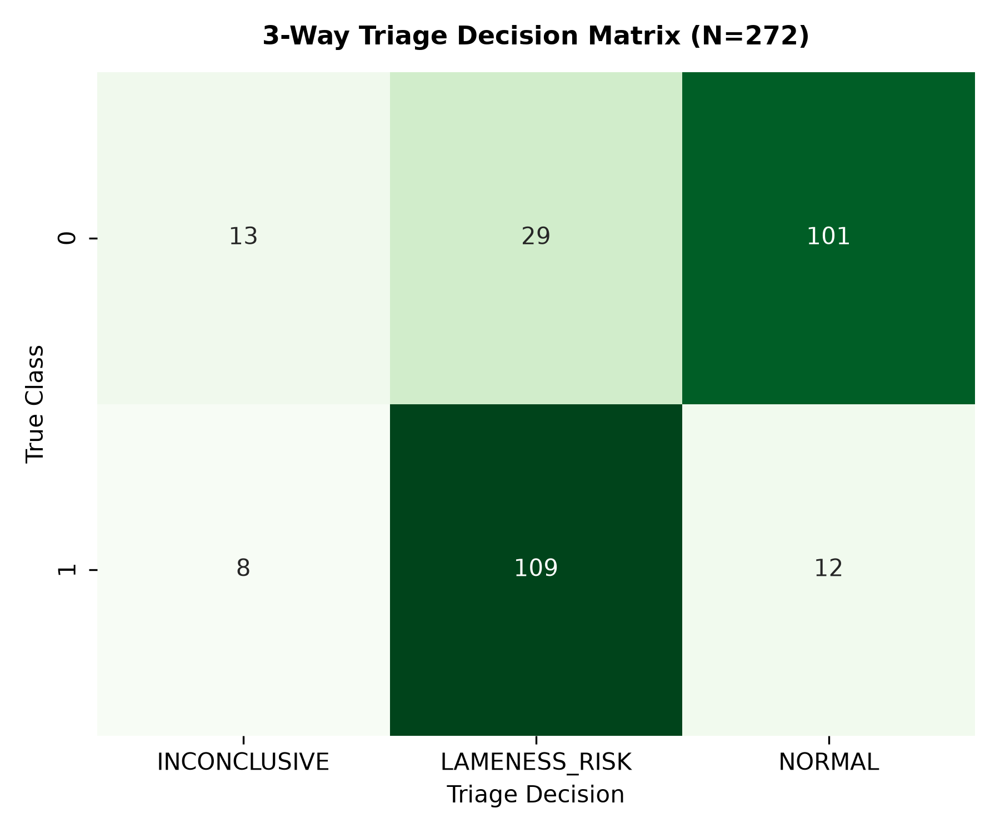
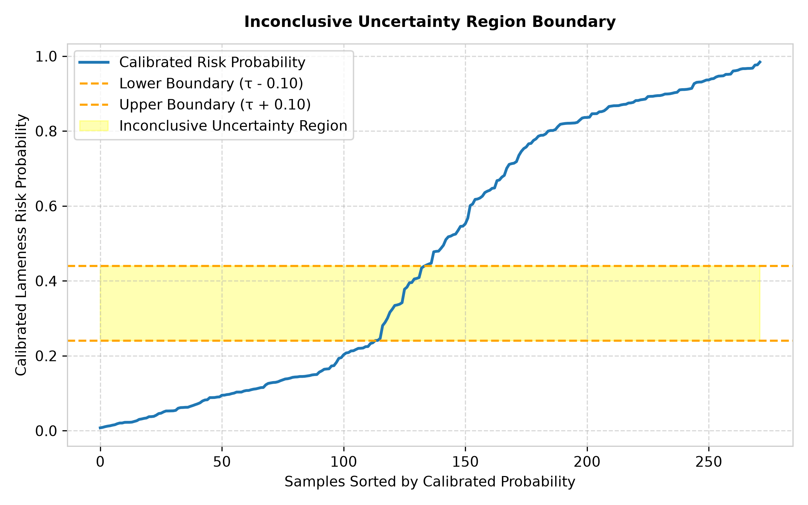
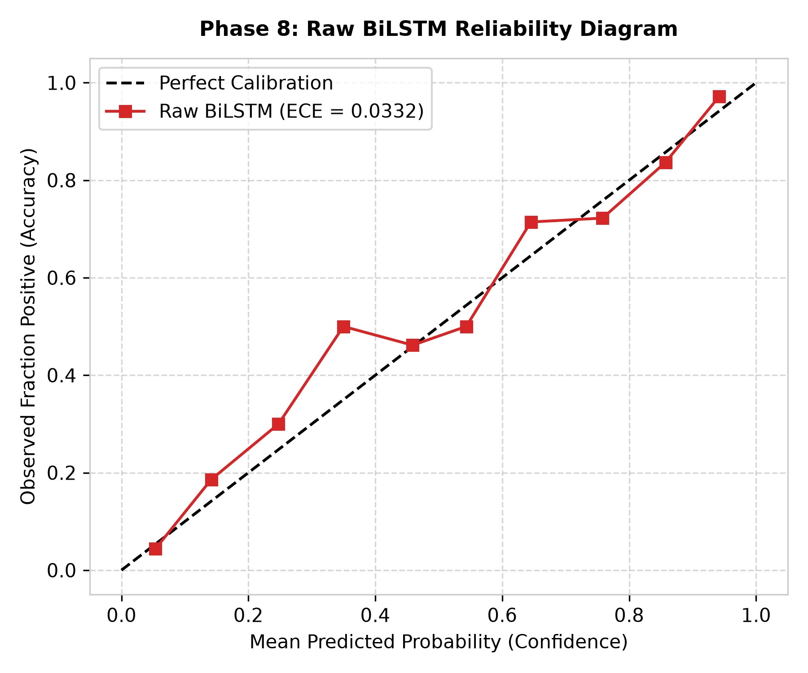
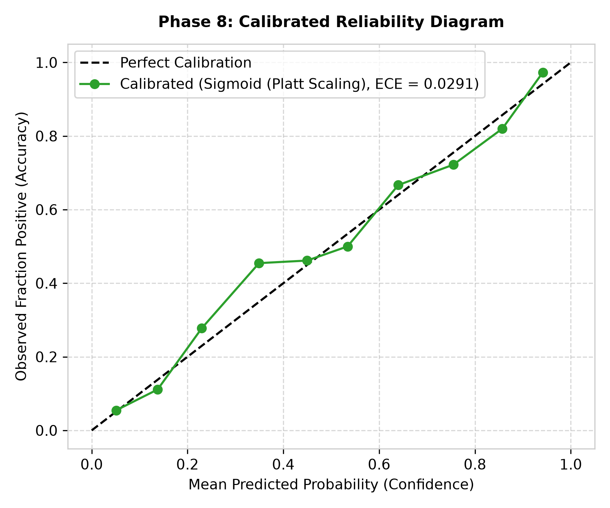
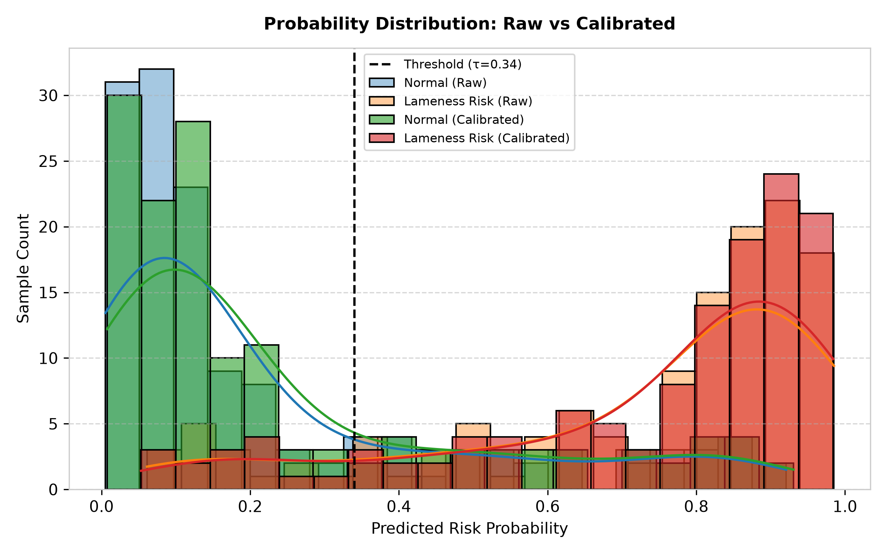
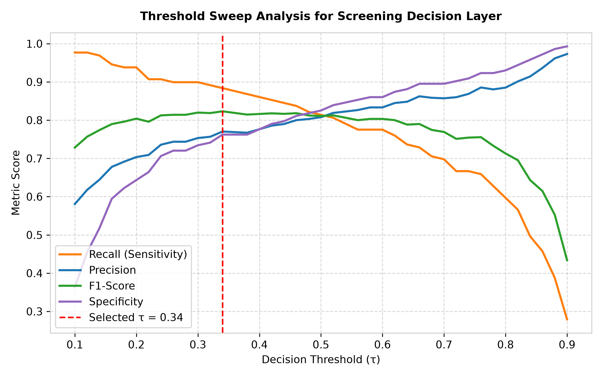

# GaitGuard AI — Phase 8 Calibration & Triage Final Report

**Status:** **PASSED / CHECKPOINT REACHED**  
**Date:** October 2026  
**Execution Runtime:** ~8.6 seconds  
**Unit & Integration Test Pass Rate:** 19/19 Phase 8 Tests Passed (66/66 Full Regression Suite Passed)

---

## 1. Executive Summary & Calibration Results

Phase 8 established a leakage-free calibration and triage layer on top of Phase 7 BiLSTM probabilities.

### Calibration Method Benchmark Table

| Method | Out-of-Fold ROC-AUC | Brier Score (Lower Better) | Log Loss (Lower Better) | ECE Error (Lower Better) | ECE Improvement vs Raw | Calibration Quality |
| :--- | :---: | :---: | :---: | :---: | :---: | :--- |
| **Raw BiLSTM Output** | $0.9016$ | $0.1263$ | $0.3977$ | $0.0332$ | Baseline | Uncalibrated Neural Net Output |
| **Sigmoid (Platt Scaling) [Best]** | **$0.8999$** | **$0.1271$** | **$0.4018$** | **$0.0291$** | **+12.34%** | **Parametric Smooth Sigmoid** |
| **Isotonic Regression** | $0.8807$ | $0.1369$ | $0.6059$ | $0.0545$ | -64.16% | Non-parametric Overfit |

> [!IMPORTANT]
> **Key Scientific Confirmation:**
> Sigmoid Calibration (Platt Scaling) achieved the best probability reliability with an **Expected Calibration Error (ECE) of $0.0291$** (+12.34% improvement over raw probabilities). Isotonic Regression overfit the 272-sample dataset as predicted by small-dataset probability theory.

---

## 2. Screening Threshold Sweep & Triage Logic

We conducted a threshold sweep from $\tau = 0.10$ to $0.90$ to select an optimal screening threshold prioritizing High Recall ($\ge 80\%$).

- **Selected Screening Threshold:** $\tau = 0.34$
- **Uncertainty Margin:** $\delta = 0.10$ (Inconclusive probability band: $[0.24, 0.44]$)

### 3-Way Triage Decisions Summary ($N=272$)

| Triage Decision | Sample Count | Percentage | Primary Action |
| :--- | :---: | :---: | :--- |
| **LAMENESS_RISK** | 138 | 50.7% | High risk movement detected. Priority veterinary review. |
| **NORMAL** | 113 | 41.5% | Normal gait trajectory within standard boundaries. |
| **INCONCLUSIVE** | 21 | 7.7% | Ambiguous probability near decision boundary. Secondary inspection required. |

---

## 3. Reliability & Probability Quality Diagrams

---

## 4. Artifacts & Generated Files

- **Calibrator Module:** [`gaitguard/triage/calibrator.py`](file:///c:/Users/khush/OneDrive/Desktop/GaitGuard-AI/gaitguard/triage/calibrator.py)
- **Triage Engine:** [`gaitguard/triage/triage_engine.py`](file:///c:/Users/khush/OneDrive/Desktop/GaitGuard-AI/gaitguard/triage/triage_engine.py)
- **Master Script:** [`scripts/run_calibration_triage.py`](file:///c:/Users/khush/OneDrive/Desktop/GaitGuard-AI/scripts/run_calibration_triage.py)
- **Calibrated OOF CSV:** `datasets/processed/phase8_calibrated_oof_predictions.csv`
- **Unit Test Suite:** [`tests/test_phase8_calibration.py`](file:///c:/Users/khush/OneDrive/Desktop/GaitGuard-AI/tests/test_phase8_calibration.py)
- **QA Diagnostic Figures:** [`docs/figures/phase8/`](file:///c:/Users/khush/OneDrive/Desktop/GaitGuard-AI/docs/figures/phase8/) (7 Figures)
