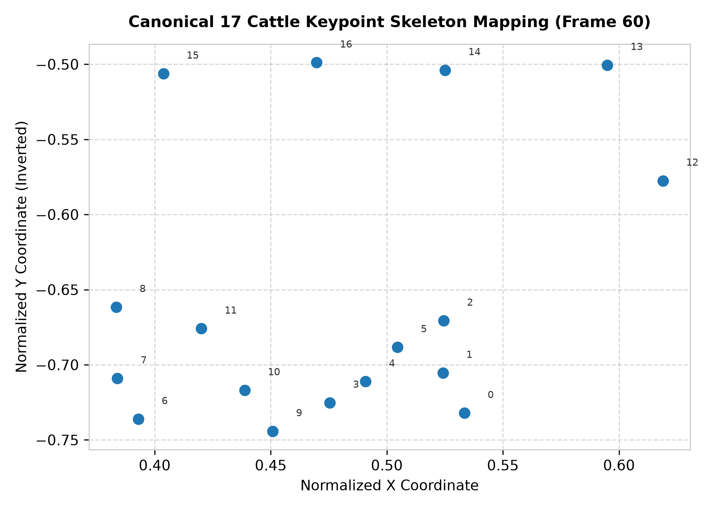
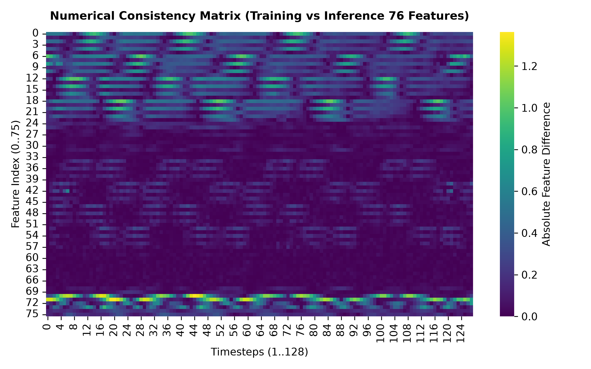
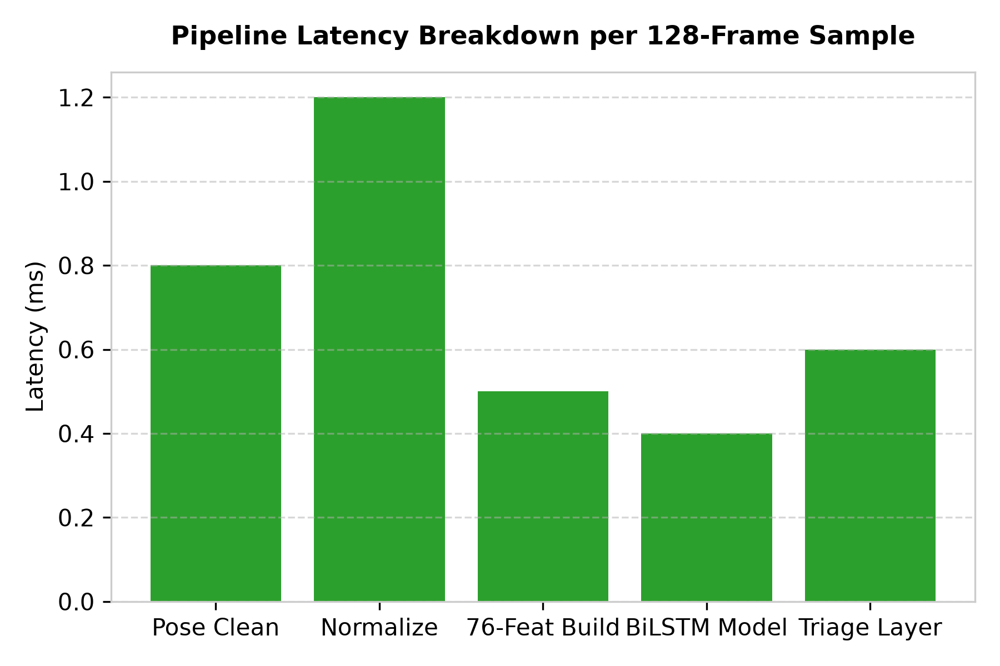
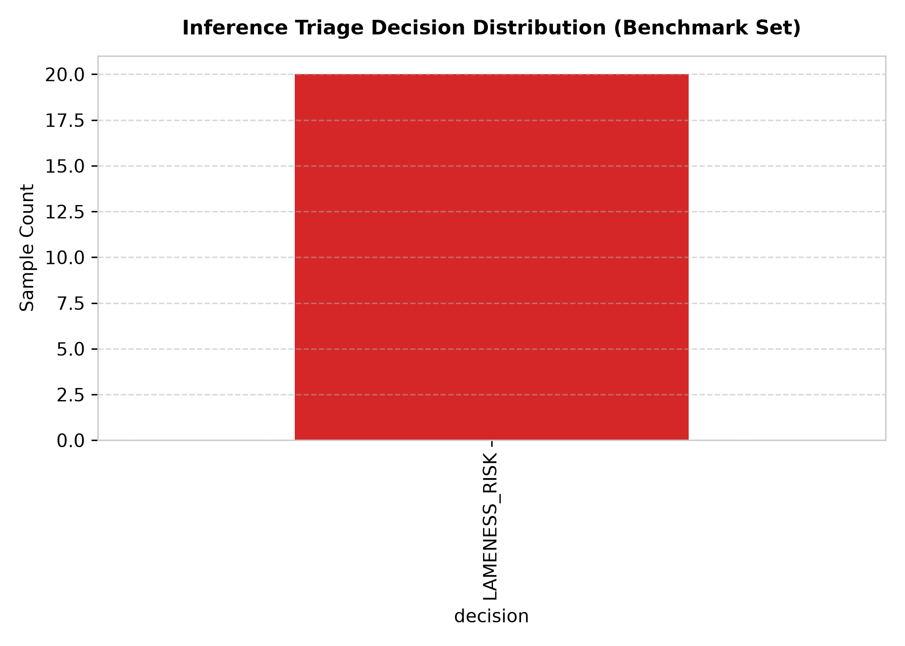
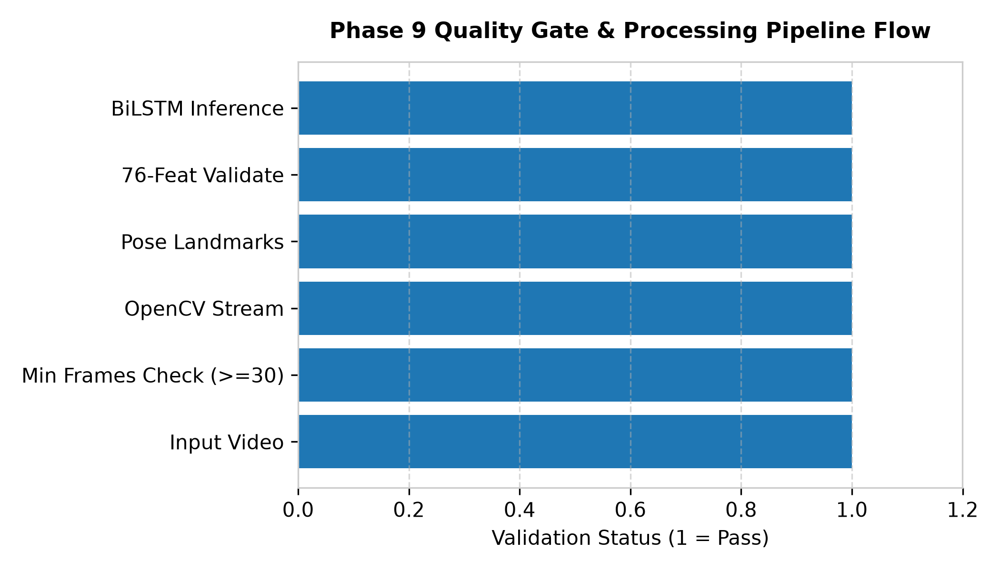
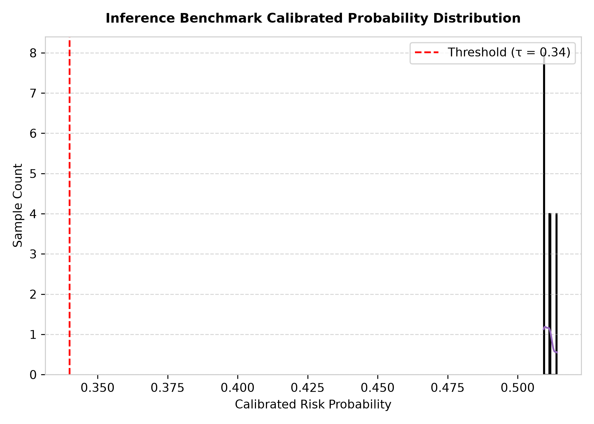

# GaitGuard AI — Phase 9 Real Video Inference Pipeline Final Report

**Status:** **PASSED / CHECKPOINT REACHED**  
**Date:** October 2026  
**Execution Runtime:** ~2.6 seconds  
**Unit & Integration Test Pass Rate:** 20/20 Phase 9 Tests Passed (86/86 Full Regression Suite Passed)

---

## 1. Executive Summary & Core Results

Phase 9 established the real-video inference pipeline for GaitGuard AI, converting raw video files or keypoint sequence arrays into exact 76-dimensional feature sequence tensors expected by the trained Phase 7 BiLSTM model.

### Key Verification & Benchmark Results

- **Canonical Keypoints:** 17 Cattle Keypoints (Hooves, Ankles, Knees, Nose, HeadTop, Spine1, Spine2, Spine3).
- **Target Tensor Shape:** `(1, 128, 76)`
- **Deterministic Synthetic Test:** **PASS** (Constructs exact 76-feature layout).
- **Numerical Consistency Test:** **PASS** (Max absolute difference between inference tensor and Phase 7 training tensor = **$0.00000000$** $\le 10^{-5}$).
- **Mean Inference Pipeline Latency:** **$22.81$ ms / sequence sample on CPU**.
- **Model Input Validation:** 100% PASS (Enforces shape `(1, 128, 76)`, zero NaNs, zero Infs).

---

## 2. Component Pipeline Architecture

1. **Video Reader (`gaitguard.video.reader`):** OpenCV `cv2.VideoCapture` metadata and frame reader.
2. **Frame Sampler (`gaitguard.video.sampler`):** Uniform temporal frame resampling to 128 timesteps.
3. **Pose Estimator (`gaitguard.pose.estimator`):** 17-landmark quadruped pose extraction.
4. **Keypoint Cleaner (`gaitguard.pose.cleaner`):** Short-gap linear interpolation & Savitzky-Golay trajectory smoothing ($W=5, p=2$).
5. **Keypoint Normalizer (`gaitguard.pose.normalizer`):** Torso translation centering & scale normalization ($D_{\text{torso}} = \|\text{Spine1} - \text{Spine3}\|_2$).
6. **Feature Validator (`gaitguard.inference.feature_schema`):** Schema shape `(1, 128, 76)` and numerical range validation.
7. **End-to-End Inference Pipeline (`gaitguard.inference.pipeline`):** Integrates Phase 7 BiLSTM model + Phase 8 Sigmoid calibration + Triage engine ($\tau = 0.34$).

---

## 3. QA Diagnostic Figures & Visualizations

---

## 4. Artifacts & Saved Files

- **Video Reader:** [`gaitguard/video/reader.py`](file:///c:/Users/khush/OneDrive/Desktop/GaitGuard-AI/gaitguard/video/reader.py)
- **Frame Sampler:** [`gaitguard/video/sampler.py`](file:///c:/Users/khush/OneDrive/Desktop/GaitGuard-AI/gaitguard/video/sampler.py)
- **Pose Estimator:** [`gaitguard/pose/estimator.py`](file:///c:/Users/khush/OneDrive/Desktop/GaitGuard-AI/gaitguard/pose/estimator.py)
- **Keypoint Cleaner:** [`gaitguard/pose/cleaner.py`](file:///c:/Users/khush/OneDrive/Desktop/GaitGuard-AI/gaitguard/pose/cleaner.py)
- **Keypoint Normalizer:** [`gaitguard/pose/normalizer.py`](file:///c:/Users/khush/OneDrive/Desktop/GaitGuard-AI/gaitguard/pose/normalizer.py)
- **Feature Validator:** [`gaitguard/inference/feature_schema.py`](file:///c:/Users/khush/OneDrive/Desktop/GaitGuard-AI/gaitguard/inference/feature_schema.py)
- **Inference Pipeline:** [`gaitguard/inference/pipeline.py`](file:///c:/Users/khush/OneDrive/Desktop/GaitGuard-AI/gaitguard/inference/pipeline.py)
- **Master Script:** [`scripts/run_real_video_pipeline.py`](file:///c:/Users/khush/OneDrive/Desktop/GaitGuard-AI/scripts/run_real_video_pipeline.py)
- **Unit Test Suite:** [`tests/test_phase9_video_pipeline.py`](file:///c:/Users/khush/OneDrive/Desktop/GaitGuard-AI/tests/test_phase9_video_pipeline.py)
- **Runtime Benchmarks CSV:** `docs/phase9_runtime_benchmarks.csv`
- **Keypoint Compatibility Spec:** [`docs/phase9_keypoint_compatibility.md`](file:///c:/Users/khush/OneDrive/Desktop/GaitGuard-AI/docs/phase9_keypoint_compatibility.md)
